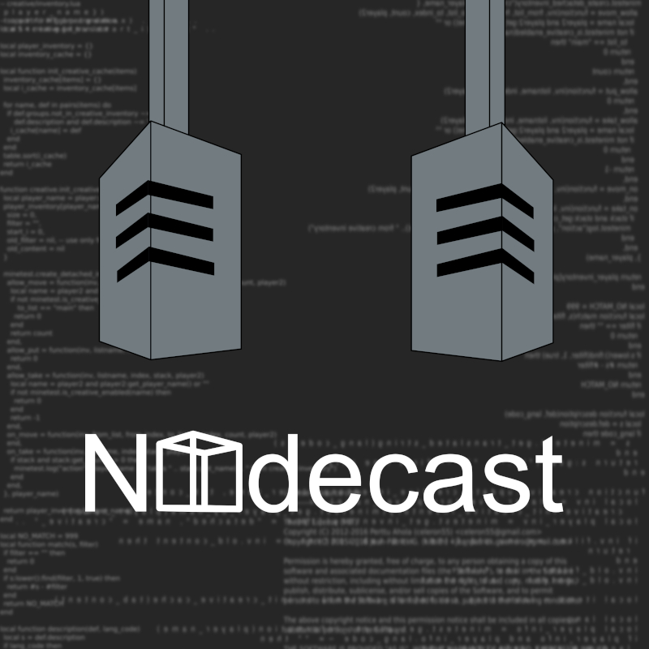

# The Unofficial Minetest Podcast
## Rolling release, interview-centered podcast about minetest.
> New episodes released every 1st and 3rd Friday of the month, as close to 00:00:00 UTC as possible
> 
> Currently hosted through pcloud (cloud backup service), and pending youtube upload.
>
> Many many more platforms are in the works, but podcasts are being frowned upon by the streaming industry, so please be patient.
- ## [Episodes](episodes/readme.md): Every released episode and show notes
- ## [Podcasting Stuff](podcasting_stuff): ExeVirus's deskspace

